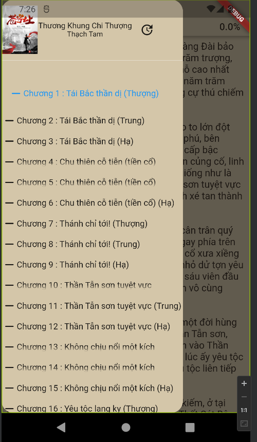

# Virtual-Book-Application

This is an application for reading app from multiple sources as plugins -> can extend source list

- SDK: Flutter with Dart
- Database: sqflite
- Miro scratch: https://miro.com/app/board/uXjVPUUgKBE=/?share_link_id=290946286472

## 💻 Requirements

- Any Operating System (ie. MacOS X, Linux, Windows)
- Any IDE with Flutter SDK installed (ie. IntelliJ, Android Studio, VSCode etc)
- A little knowledge of Dart and Flutter

## 📸 ScreenShots

<!--  -->

| Light                             | Dark                              |
| --------------------------------- | --------------------------------- |
|   |   |
|   |   |
|   |   |
|   | --------------------------------- |

## ✨ Features

- [x] Read eBooks.
- [x] Favorites (add to bookshelf).
- [x] Longpress to delete favorites.